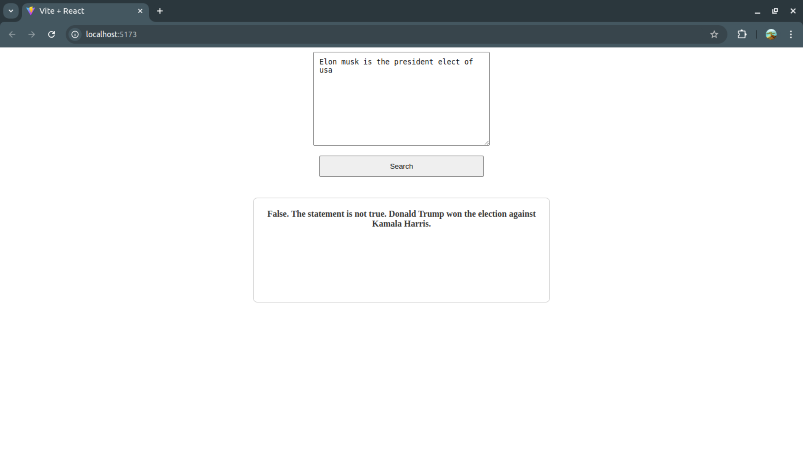

# TruthTracker

## About the Project
TruthTracker is an innovative tool that verifies the truthfulness of statements by scraping Google for related articles. It uses the Google Gemini API to compare these articles and determine if the entered statement is true or false.
This project consists of a dummy frontend, a backend 
- **frontend**: Contains the code for a simple input box to accept input/query from user.
- **backend**: Contains the server-side logic to store the input and the information from articles related to the query.

## Project Preview


## Installation
To run this project locally, follow these steps:

### Prerequisites

Before running the project, make sure you  have the following installed:
- Node.js (https://nodejs.org/)
- npm (Node Package Manger, comes with Node.js)

1. **Clone the repository:**
    ```bash
    git clone https://github.com/your-username/truthtracker.git
    cd truthtracker
    ```

2. **Install dependencies:**
    ```bash
    cd frontend
    npm install
    ```
    ```
    cd backend
    npm install
    pip install googlesearch-python beautifulsoup4 requests
    ```

3. **Run the application:**
    In the frontend folder run
    ```bash 
    npm run dev
    ```
    In the backend folder run
    ```bash 
    node index.js
    ```

## How It Works
1. Enter a statement you want to verify.
2. TruthTracker scrapes Google for related articles.
3. The Google Gemini API compares these articles.
4. The tool provides a verdict on whether the statement is true or false.

## Features
- **Automated Scraping**: Efficiently gathers articles from Google.
- **Advanced Comparison**: Uses the Google Gemini API for accurate analysis.
- **User-Friendly Interface**: Easy to use, even for those with minimal technical knowledge.

## Development
This project is developed using Python and involves web scraping and API integration for effective data validation.

## Contributing
Contributions are welcome! Feel free to submit a pull request or open an issue to suggest improvements.
---
